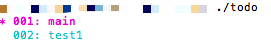
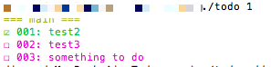
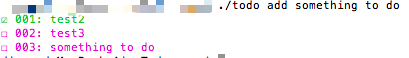
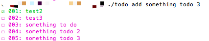
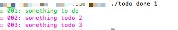
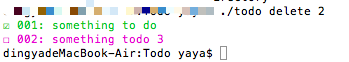
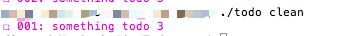
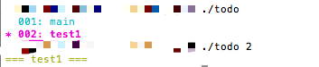
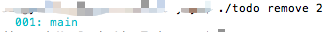
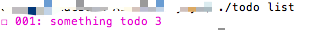

# Todo
a cli todo list 
**本项目改写自mattn大神的项目[todo](https://github.com/mattn/todo)**
mattn的todo简单好用，在使用过程中，我发现自己想要对不同的项目的todo清单进行分类，而原项目没有支持
于是自行改写成本项目，修改了命令行工具包（[cli](https://github.com/urfave/cli)比mattn使用的[commander](https://github.com/gonuts/commander)star数更多一些）

感谢大神的代码，让我省下了一半的时间（todo文件的读写程序完全照搬）

基于mattn的todo上，多了如下功能：
- new指令：创建一个新的todo类型
- remove指令：删除指定的数据类型

获取方式：
```shell
go get github.com/b3log/Todo
```

使用过程可能如下(图例中是在当前目录下执行的指令，所以有./，实际放到环境变量下的指令不需要加，部分图例可能因为后续改进有轻微差异)：
```shell
todo #显示当前有何类型
```

```shell
todo 1 # 选择序号为1的类型，此时当前工作的类型是1
```

```shell
todo add something todo # 向类型1添加一个待办事项
```

```shell
todo add something todo 2 # 继续添加
todo add something todo 3 # 继续添加
```

```shell
todo done 1 # 完成了第一个事项
```

```shell
todo delete 2 # 删除第二个待办事项
```

```shell
todo clean # 清除已完成的事项
```

```shell
todo 2 # 选择序号为2的类型，此时看到2类型下的待办事项
```

```shell
todo remove 2 # 删除类型为2的待办事项
```

```shell
todo 1 # 再次选择类型为1的待办事项
```
```shell
... # other jobs
todo list # 显示当前工作的待办事项
```


欢迎各位使用 :tada:
